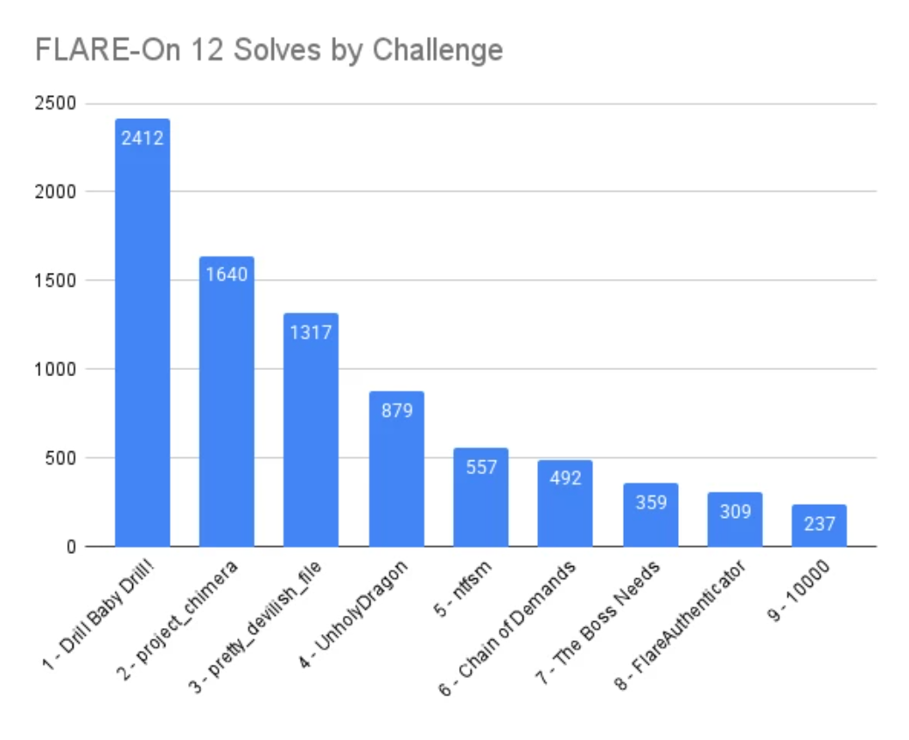

# Flare-On 12

Flare-On 是以逆向工程挑戰為主的 CTF 挑戰，今年題目總共九題，他的機制是解完一題後，才能進入下一題，難度也會愈來愈高，但也因此若前面卡關，將連帶影響後續的解題進度。

今年是我首次參加，四周的比賽時間內，只解出了 4 題。

## 完成度分布

## Writeups

> 原始題目壓縮檔存於 [attachments](./attachments/)，密碼為 `flare`

1. [Drill Baby Drill!](./drill_baby_drill.md)
2. Project Chimera
3. Pretty Devilish File
4. UnholyDragon
