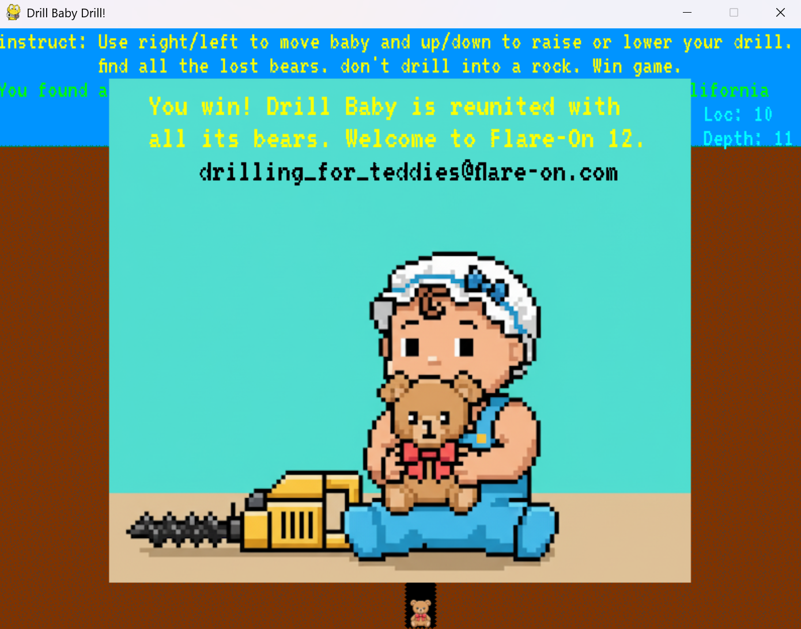

# Drill Baby Drill!

## 概述

題目是一個以 PyGame 寫成的遊戲檔案，附上 `DrillBabyDrill.exe` 執行檔和 `DrillBabyDrill.py` 原始碼，遊戲目標為使用方向鍵操控角色和鑽頭，鑽到石頭就失敗，找到小熊就算獲勝

## 分析原始碼

相信目標是破解這款遊戲的獲勝方式，閱讀原始碼，果真很快就看到 `GenerateFlagText` 函式

```python
def GenerateFlagText(sum):
    key = sum >> 8
    encoded = "\xd0\xc7\xdf\xdb\xd4\xd0\xd4\xdc\xe3\xdb\xd1\xcd\x9f\xb5\xa7\xa7\xa0\xac\xa3\xb4\x88\xaf\xa6\xaa\xbe\xa8\xe3\xa0\xbe\xff\xb1\xbc\xb9"
    plaintext = []
    for i in range(0, len(encoded)):
        plaintext.append(chr(ord(encoded[i]) ^ (key+i)))
    return ''.join(plaintext)
```

繼續追蹤，如下位於 `main` 函式的程式碼片段呼叫 `GenerateFlagText`，並輸出了 flag

```python
if bear_mode:
    screen.blit(bearimage, (player.rect.x, screen_height - tile_size))
    if current_level == len(LevelNames) - 1 and not victory_mode:
        victory_mode = True
        flag_text = GenerateFlagText(bear_sum)
        print("Your Flag: " + flag_text)
```

再仔細分析 `main` 函式內容，整個遊戲邏輯由兩個大迴圈組成，外層迴圈處理每個遊戲關卡開始前的設置，內層迴圈處理一個遊戲關卡的流程，包含接收玩家方向鍵輸入、判斷是否鑽到石頭或小熊。

### 勝利條件

搭配前段程式碼片段的條件判斷，發現當進入 `bear_mode` 且當前的關卡等級到最後一級時，才會輸出 flag。而 `bear_mode` 用於表示是否挖到小熊，向前追蹤，只有當 `player.hitBear()` 成立時，才算是挖到小熊

```python
random.shuffle(LevelNames)

while running:
    # ...level setup...

    while running and not next_level_mode:
        # ...handel user input...

        # ...draw actions...

        if boulder_mode:
            statustext = "You Hit a Boulder, please reload try again when you are better at video games"
            statussurface = gamefont.render(statustext, False, pygame.Color('red'))
            screen.blit(statussurface, (0, 48))
        else:
            if bear_mode:
                statustext = "You found a bear, press any key to drill for another!"
                statussurface = gamefont.render(statustext, False, pygame.Color('green'))
                screen.blit(statussurface, (0, 48))
            
            leveltext = 'Level: ' + LevelNames[current_level]
            levelnamesurface = gamefont.render(leveltext, False, pygame.Color('green'))
            screen.blit(levelnamesurface, (screen_width - 12*len(leveltext), 48))
        
        # ...draw action...

        if player.hitBoulder():
            boulder_mode = True

        if player.hitBear():
            player.drill.retract()
            bear_sum *= player.x
            bear_mode = True
        
        if bear_mode:
            screen.blit(bearimage, (player.rect.x, screen_height - tile_size))
            if current_level == len(LevelNames) - 1 and not victory_mode:
                victory_mode = True
                flag_text = GenerateFlagText(bear_sum)
                print("Your Flag: " + flag_text)
        
        # ...other actions...
```

`player.hitBear` 實作邏輯為，當前鑽的深度為最大深度時回傳 `True`，也就是說，只要不碰到石頭並挖到底，就算是找到小熊。

```python
def hitBear(self):
    return self.drill.drill_level == max_drill_level
```

因此，接著關注地圖是怎麼決定石頭位置的，就可以有效避開石頭並挖到底

### 障礙物生成

檢查 `player.hitBoulder()` 實作邏輯，當前鑽的深度達到 `boulder_level` 時，就算碰到障礙物，而 `boulder_level` 值為 `boulder_layout` 陣列中，角色所在位置作為 index 的值

由此可見，每一直行的石頭位置，生成於 `boulder_layout` 陣列中，`boulder_layout` 在 `main` 函式內外層大迴圈進入關卡前被設定

```python
while running:
    background_tiles = BuildBackground()
    player = DrillBaby(7, 2, max_drill_level)
    boulder_layout = []
    for i in range(0, tiles_width):
    if (i != len(LevelNames[current_level])):
        boulder_layout.append(random.randint(2, max_drill_level))
    else:
        boulder_layout.append(-1)

    while running and not next_level_mode:
        # ...
```

由上片段，每一行會被隨機填充一個數字，只有當關卡名稱字串長度的那一行，會被填充為 `-1` (表示沒有障礙物)，例如: 關卡名稱為 "California"，長度為 10，因此陣列 index 10 會被設為 `-1`

## 解答

1. 執行 `DrillBabyDrill.exe` 進入遊戲
2. 檢查當前關卡名稱字數，角色移動到對應數字座標 (最左邊一格座標從 0 開始算)
3. 往下鑽到底，過關!
4. 重複 2.~3.，直到過完五關，即顯示 flag

