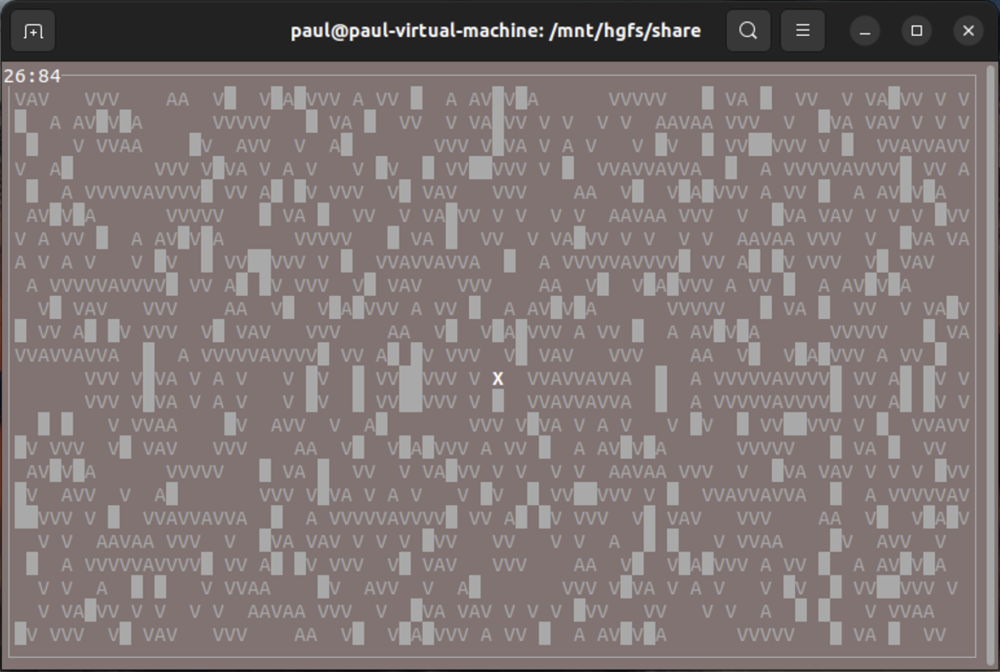
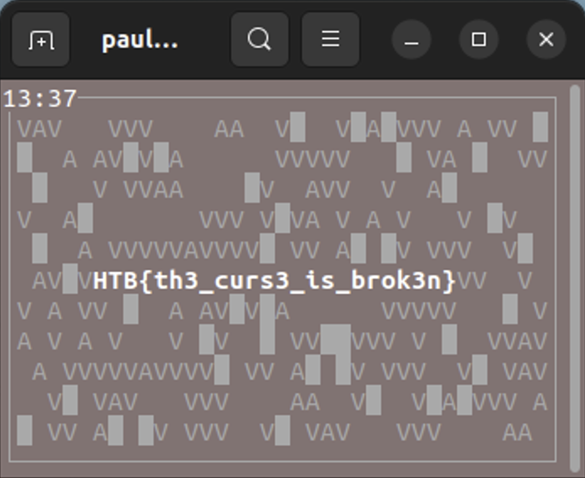

# Impossimaze

## Description

Elowen has been cursed to roam forever in an inescapable maze. You need to break her curse and set her free.

[Attachment link](../files/rev_impossimaze/main)

## Solution

### Detect the file

I first detect the file by putting it into DIE, and I found that it is ELF64 format. When I run it on Ubuntu, the output shows below.



### Analysis decompiled code

I wanted to know the original program flow, so I used IDA to analyze this file. Checking the "main" part of the decompiled code, I found it to be a TUI program made by ncurses, a common Linux library for creating TUIs.

After reading the decompiled code, I renamed most of the variables with meaningless names within the program to names that are easier for humans to understand.

In the latter part of the code, I discovered an interesting thing: a specific `if` condition that performs some unusual actions when the window height is 13 and the window width is 37.

```c
if ( screenHeight == 13 && screenWidth == 37 )
{
  wattr_on(stdscr, 0x80000uLL, 0LL);
  wattr_on(stdscr, 0x200000uLL, 0LL);
  v10 = (int *)&unk_40C0;
  for ( j = 6; j != 30; ++j )
  {
    v12 = j;
    if ( wmove(stdscr, 6, v12) != -1 )
      waddch(stdscr, byte_4120[*v10]);
    ++v10;
  }
  wattr_off(stdscr, 0x200000uLL, 0LL);
  wattr_off(stdscr, 0x80000uLL, 0LL);
}
```

Moreover, this `if` condition is nested inside a large loop that runs each time a key is pressed or the program window is dragged.

### Get the flag

Instead of trying to understand what the code inside the `if` condition did, I dragged the window to make it meet the condition.  And just like that, the flag was printed.


