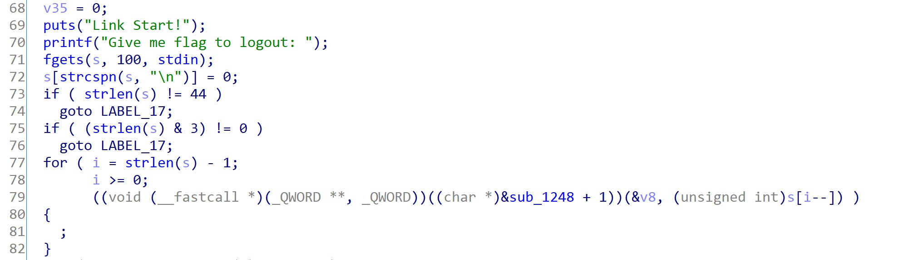
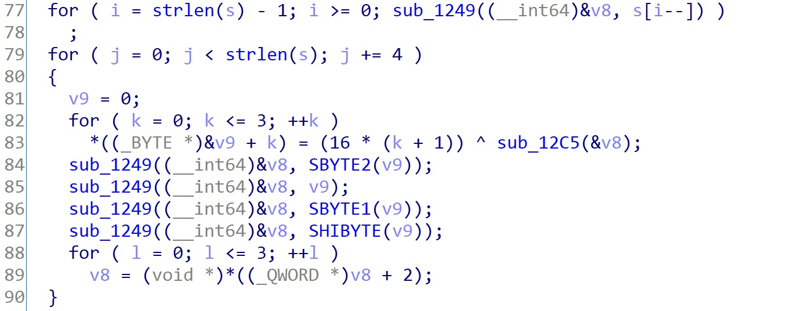
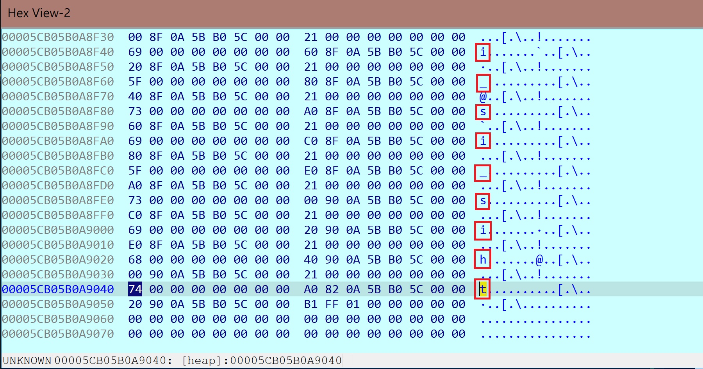

# Link Start

You have a chance to logout if you know the flag.

檔案: [chal](./chal)

## 概觀

下載檔案後，發現是一個 64 位元 ELF

```shell
$ file chal
chal: ELF 64-bit LSB pie executable, x86-64, version 1 (SYSV), dynamically linked, interpreter /lib64/ld-linux-x86-64.so.2, BuildID[sha1]=66fdae43943dd9b2f528b584ef3bbc06b071b473, for GNU/Linux 3.2.0, stripped
```

執行發現需要輸入一組 flag，先隨便給 "123" 當作輸入，發現 Failed


### 反編譯

開啟 IDA pro x64，找到 `main` 函式 **F5** 反編譯看程式流程。

發現要求輸入後，會先判斷輸入長度是否等於 44，若不是就跳到 `LABEL_17`


`LABEL_17` 即輸出 Failed 文字的地方


觀察輸入的字串會用到的地方，觀察到其於 `79` 行與 `v8` 一起做為參數使用，`v8` 再於 `83` ~ `95` 行經過一連串迴圈運算，最後與 `s1` 一起做為參數使用 (類似以某種方式將 `v8` 賦值給 `s1` 的感覺)。

最後 `s1` 與 `s2` 比較，相等即輸出 "Success"


### 直覺

為了使程式成功輸出 Success，需要找到一組輸入，使其經過複雜轉換後，與 `s2` 字串相等，此時找到的原始輸入應為 flag。

## 分析

程式轉換邏輯大致分為兩個 `for` 迴圈，因此將兩個迴圈拆成兩部分討論。

### IDA 錯誤解析函數

觀察反編譯原始碼 `79` 行發現，呼叫了 `&sub_1248 + 1`，以機器碼查看，發現 IDA 錯誤解析此函數起始位址為 0x1248，實際應為 0x1249。

```asm
.text:0000000000001248 sub_1248        proc near               ; CODE XREF: main+216↓p
.text:0000000000001248                                         ; main+2A4↓p ...
.text:0000000000001248                 push    rbx
.text:0000000000001248 sub_1248        endp ; sp-analysis failed
.text:0000000000001248
.text:000000000000124A                 nop     edx
.text:000000000000124D                 push    rbp
.text:000000000000124E                 mov     rbp, rsp
.text:0000000000001251                 sub     rsp, 20h
.text:0000000000001255                 mov     [rbp-18h], rdi
```

因此，取消定義 `&sub_1248`，重新定義一個新函數於位址 0x1249。

```asm
.text:0000000000001249 sub_1249        proc near               ; CODE XREF: main+216↓p
.text:0000000000001249                                         ; main+2A4↓p ...
.text:0000000000001249
.text:0000000000001249 var_1C          = byte ptr -1Ch
.text:0000000000001249 var_18          = qword ptr -18h
.text:0000000000001249 var_8           = qword ptr -8
.text:0000000000001249
.text:0000000000001249 ; __unwind {
.text:0000000000001249                 endbr64
.text:000000000000124D                 push    rbp
.text:000000000000124E                 mov     rbp, rsp
.text:0000000000001251                 sub     rsp, 20h
.text:0000000000001255                 mov     [rbp+var_18], rdi
```

正確反編譯結果


### 第一個迴圈

將輸入的字串，從尾到頭每個字元與 `v8` 一同傳入 `sub_1249` 函式，進入該函式內部，看到其分配了一塊空間，並設定該空間第一個元素為傳入的字元。


`v8` 為一個指標，其指向一段 heap 空間。

設定斷點於呼叫 `sub_1249` 的位置，動態執行觀察 `v8` 指向空間之值，可發現，每次執行 `sub_1249` 後，`v8` 指向位置皆會改變，並且於原指向位置留下一塊已分配的空間，並且該空間首個 byte 為傳入的字元。

給定輸入為 `this_is_input_1234567890_abcdefghijklmnopqrs` ，下圖為執行完整個 `for` 迴圈的結果，**紅圈**為每次執行 `sub_1249` 後，分配出空間的首個元素，將每個字元拼起來，即為所輸入的字串。


### 第二個迴圈

輸入字串共 44 個字元，每次 4 個字元做迭代，內部有第二個迴圈，共做四次迭代，第一至第四次迭代將 `(16 * (k + 1)) ^ sub_12C5(&v8)` 的運算結果存至 `v9` 的第一至第四個 byte。

動態執行觀察 `sub_12C5(&v8)` 結果為何，於呼叫處設斷點，動態執行觀察回傳值。


迭代四次，觀察到四次執行後回傳值為 0x74、0x68、0x69、0x73，剛好能對應輸入的四個字元 't'、'h'、'i'、's'，由此可見，`sub_12C5(&v8)` 會依序回傳輸入字元的 Ascii 碼。

由以上得知，外層迴圈每次取 4 個輸入的字元，內層迴圈依序將字元的 Ascii 碼與 16、32、48、64 做 XOR 運算，再依序存入 `v9` 的第 1、2、3、4 個 byte。

內層迴圈接續執行 :

```C
sub_1249((__int64)&v8, SBYTE2(v9));
sub_1249((__int64)&v8, v9);
sub_1249((__int64)&v8, SBYTE1(v9));
sub_1249((__int64)&v8, SHIBYTE(v9));
```

四次函數分別傳入先前第 3、1、2、4 個 XOR 運算結果，動態執行外層迴圈，觀察所創建出的空間之值。

紅圈即為轉換後結果，由高位至低位，分別為將原始字串，每 4 個字元一組，分別與 16、32、48、64 做 XOR 運算，並將這 4 個運算結果，以第 4、2、1、3 個為順序排列至記憶體位置高至低處。


驗證如下:
>
> 輸入字串為 "this"，Ascii 碼分別為 0x74、0x68、0x69、0x73，分別對 0x10、0x20、0x30、0x40 做 XOR 運算
>
> 0x74 xor 0x10 = 0x64
>
> 0x68 xor 0x20 = 0x48
>
> 0x69 xor 0x30 = 0x59
>
> 0x73 xor 0x40 = 0x33
>
> 將運算結果以第 4、2、1、3 個為順序排列為: 0x33、0x48、0x64、0x59，轉成字元為: '3'、'H'、'd'、'Y'，正好對應上述紅圈前四個字元 (由記憶體高位至低位)。

### 比對

動態執行觀察 `sub_133F` 函式首先將第二個迴圈所轉換的字元，拼成一個字串，賦值給 `s1`，再讓 `s1` 與 `s2` 做比對。

`s2` 字串之值如下:


## 解決方案

以 Python 逆運算，得到一組輸入滿足 XOR 運算後指定之值

檔案: [solution.py](./solution.py)

```python
target = [
    0x3B, 0x73, 0x44, 0x73, 0x1F, 0x10, 0x49, 0x45,
    0x1F, 0x72, 0x24, 0x55, 0x71, 0x7F, 0x71, 0x7C,
    0x24, 0x6B, 0x7E, 0x03, 0x75, 0x6C, 0x4F, 0x79,
    0x21, 0x7F, 0x64, 0x7D, 0x12, 0x74, 0x63, 0x55,
    0x21, 0x60, 0x4F, 0x5B, 0x0D, 0x6C, 0x4F, 0x7C,
    0x3D, 0x5E, 0x6E, 0x4E
]

original_flag = []

for start_index in range(0, 44, 4):
    original_flag.append(chr(0x10 ^ target[start_index + 2]))
    original_flag.append(chr(0x20 ^ target[start_index + 1]))
    original_flag.append(chr(0x30 ^ target[start_index + 3]))
    original_flag.append(chr(0x40 ^ target[start_index]))

print(''.join(original_flag))
```

### Flag

```text
TSC{Y0u_4Re_a_L1nK3d_LI5t_MasTeR_@ka_LLM~~~}
```
