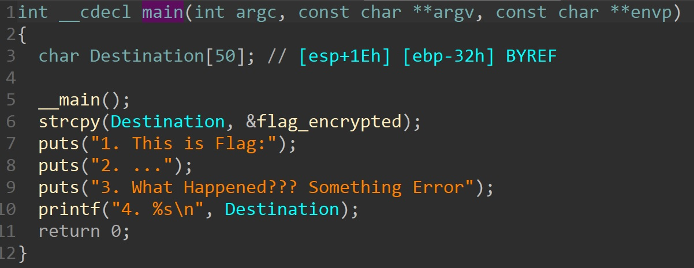
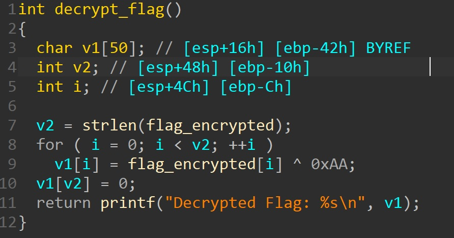

# What Happened

其實我也不太清楚發生什@#!@麼事@#情

但@#@##%(()^%()!

!%%@$東!@#%()&西#!#)&&)

放ˋˋ@($)@俺@Xsa在納莉

檔案: [main.exe](./main.exe)

## 概觀

下載檔案，送入 DIE 工具檢測發現是個 32 位元 PE 格式，執行結果如下

```shell
> main.exe
1. This is Flag:
2. ...
3. What Happened??? Something Error
4. 橐裷藥隸蚥裞嚆秝?尰臢聈ecrypted Flag: %s
```

## 分析

拖入 IDA Pro，將入口函式反編譯，只看到程式輸出四行執行時候輸出的字，並在一開始時將 `flag_encrypted` 賦值給 `Destination` (可能是在提示我們 flag 被加密過)，其他沒看到對於找 flag 有太大幫助的程式邏輯。



檢查 IDA 辨識出來的所有函數，發現有個函數名稱很特別，叫 `_decrypt_flag`，似乎負責將 flag 解密。


點進去看，發現其反編譯結果，有個將解密過後的 flag 輸出的程式碼。



### 動態執行解密函數

嘗試動態執行該解密函數，檢查其輸出結果為何。

透過 IDA debugger 功能，將斷點設於一開始，並且修改 `eip` 值為 `decrypt_flag` 函數所在位址，並讓其繼續執行直到整個函數執行完，最後發現經過解密，確實印出了一串訊息，並包含著 flag。


## Flag

```text
TSC{I_Think_you_Fix_2ome_3rror}
```